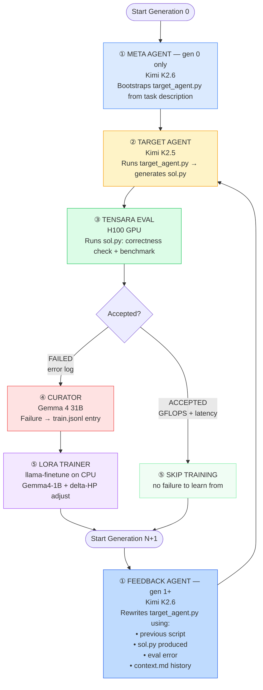

# recursive-self-improvement

**A Recursive Self-Improving AI that rewrites its own agent code from failures and fine-tunes its own weights — meta agent, feedback agent, target agent, LoRA, repeat.**

Built for the [AIEWF Hackathon 2026](https://cerebralvalley.ai/e/aiewf-hackathon-2026/details).

---

## What it does



Each generation runs five steps. The key innovation is the **feedback agent** (gen 1+): instead of writing `target_agent.py` from scratch with no memory, it reads the previous script, the kernel it produced, the specific error, and the full generation history — then surgically rewrites it to fix the exact failure pattern seen.

1. **Meta agent** (Kimi K2.6, gen 0 only) writes the initial `target_agent.py` — a Python script that instructs the target LLM how to write a Triton kernel
2. **Feedback agent** (Kimi K2.6, gen 1+) receives `previous target_agent.py + sol.py + eval result + context.md` and rewrites `target_agent.py` to fix the specific error. Accumulates `context.md` history so it doesn't repeat failed approaches.
3. **Target agent** (Kimi K2.5) executes `target_agent.py`, calls the LLM, and writes a Triton kernel to `sol.py`
4. **Tensara evaluator** submits `sol.py` to a remote H100 — checks correctness, then benchmarks for GFLOPS and latency
5. **Curator** (Gemma 4 31B) reads the failure log and `sol.py` and produces a structured `(prompt, completion)` training pair → appended to `train.jsonl`
6. **LoRA trainer** (`llama-finetune`) fine-tunes Gemma4-1B on `train.jsonl` on CPU — hyperparameters (rank, LR, epochs) self-adjust based on ΔPerformance

```
Gen 0:  Meta writes strategy  → Kimi K2.5 writes kernel → COMPILE_ERROR → curate → train Gemma4-1B
Gen 1:  Feedback sees error   → fixes system prompt      → WRONG_ANSWER  → curate → train
Gen 2:  Feedback sees pattern → adds post-processing     → ACCEPTED      → 41 GFLOPS
Gen 3:  ...                                                               → 56 GFLOPS (+36%)
```

---

## Execution flow in detail

### Step 1 — Meta agent (gen 0) and Feedback agent (gen 1+)

**Gen 0 — `run_meta_agent()`**: Calls **Kimi K2.6** with the task description and a system prompt containing Triton kernel rules. Produces the first `target_agent.py`.

**Gen 1+ — `run_feedback_agent()`**: Calls **Kimi K2.6** with:
- The previous gen's `target_agent.py` source
- The `sol.py` it produced
- The eval result (`COMPILE_ERROR`, `STATIC_CHECK_FAILED`, etc.)
- `context.md` — one line per generation summarising what was tried and what failed

The feedback agent writes `improvement.md`-style reasoning into its rewritten script, ensuring each gen addresses a specific failure rather than starting blind.

### Step 2 — Target agent (`rsi/loop.py` → subprocess)

`run_target_agent()` executes the generated `target_agent.py` as a subprocess with a 600-second timeout. Environment variables passed in:

| Env var | Value |
|---|---|
| `OPENAI_BASE_URL` | `https://inference.do-ai.run/v1/` |
| `OPENAI_API_KEY` | `MODEL_ACCESS_KEY` |
| `MODEL_NAME` | `kimi-k2.5` |
| `TASK_MD` | path to `tasks/gpu_kernel_task/task.md` |
| `OUTPUT_DIR` | path to `runs/run-NNN/gen-N/` |

The target agent calls **Kimi K2.5** and writes `sol.py` to `OUTPUT_DIR`. A `_clean_sol()` post-processor strips any reasoning prose Kimi prepends before the code.

### Step 3 — Tensara evaluation (`tasks/gpu_kernel_task/evaluate.py`)

`evaluate.py` is invoked as a subprocess. It:

1. **Locates** `sol.py` in the gen directory
2. **Static analysis** — AST-checks the Triton kernel for common errors before hitting the API:
   - Unused `tl.constexpr` params (cause `COMPILE_ERROR`)
   - `.ravel()` calls (invalid in Triton)
   - `tl.cdiv()` with non-constexpr first arg
   - Missing `import torch`
3. **Correctness check** — calls `TensaraClient.run_checker()` against the reference implementation on H100
4. **Benchmark** — if correctness passes, calls `TensaraClient.run_benchmark()` and collects per-shape GFLOPS and latency via SSE streaming
5. **Leaderboard comparison** — fetches the current leaderboard best and reports whether the solution beats it
6. **Saves** `results.json` with status, accuracy, average latency (ms), average GFLOPS, and per-shape breakdown

Possible `status` values: `ACCEPTED`, `WRONG_ANSWER`, `COMPILE_ERROR`, `RUNTIME_ERROR`, `STATIC_CHECK_FAILED`, `NO_SOLUTION_FILE`.

### Step 4 — Curation (`rsi/curate.py`)

On any non-`ACCEPTED` status where `sol.py` exists, `curate_via_api()` calls **Gemma 4 31B** with the failed kernel code and the error message. The curator returns a JSON object with `prompt` (what went wrong and how to fix it) and `completion` (the corrected kernel). Appended as one line to `train.jsonl`.

### Step 5 — LoRA training (`rsi/train.py`)

Only runs if `--base-model` is provided and `train.jsonl` is non-empty.

`run_lora_training()` invokes `llama-finetune` with:
- `--model-base` — Gemma4-1B GGUF (or the previous gen's merged GGUF)
- `--train-data` — `train.jsonl`
- `--checkpoint-in` — previous gen's LoRA adapter (Gen 0 starts fresh)
- LoRA hyperparameters from `LoraConfig`

After training, `merge_lora()` bakes the adapter into a new standalone GGUF (`gemma4-genN.gguf`).

**Hyperparameter self-adjustment** (`HyperparamTracker`):
- ΔPerformance > 0 (improving): keep current config
- ΔPerformance < 0 (regression): halve LR, add 2 epochs
- ΔPerformance = 0 (stalled): double rank and alpha, increase LR by 1.5×

---

## Architecture

```
providers/do.json               ← DO Model Studio endpoint + auth env var
profiles/kimi26-do.json         ← meta/feedback agent  (Kimi K2.6)
profiles/nemotron-do.json       ← target agent         (Kimi K2.5)
profiles/curator-do.json        ← curator              (Gemma 4 31B)

rsi/loop.py                     ← main orchestrator
                                     run_meta_agent()     — gen 0 bootstrap
                                     run_feedback_agent() — gen 1+ improvement loop
                                     update_context()     — context.md history tracker
rsi/agent.py                    ← OpenAI-compat LLM caller
rsi/curate.py                   ← failure logs → train.jsonl
rsi/train.py                    ← llama-finetune wrapper + hyperparameter tracker

tasks/gpu_kernel_task/
  task.md                       ← problem statement (matrix-vector multiply)
  evaluate.py                   ← Tensara submission + SSE result parser
  tensara_client.py             ← lightweight Tensara API client

runs/run-NNN/
  context.md                    ← one-line-per-gen history for feedback agent
  run.log                       ← full stdout+stderr log of the run
  train.jsonl                   ← curator training pairs
  gen-N/
    target_agent.py             ← script written by meta/feedback agent
    sol.py                      ← Triton kernel written by target agent
    results.json                ← Tensara eval output
```

---

## Quickstart

### 1. Clone and configure

```bash
git clone https://github.com/whatdhack/recursive-self-improvement
cd recursive-self-improvement
# export MODEL_ACCESS_KEY, TENSARA_API_KEY, TENSARA_USERID
```

### 2. Install (via miniforge3)

```bash
mamba create -n rsi python=3.10 -y
mamba activate rsi
pip install -r requirements.txt
```

### 3. Run (API-only, no local training)

```bash
python -m rsi run \
  --problem matrix-vector \
  --meta-agent-profile profiles/kimi26-do.json \
  --target-agent-profile profiles/nemotron-do.json \
  --curator-profile profiles/curator-do.json \
  --max-gen 10 \
  --run-id 001 \
  --run-dir ~/rsi_runs/runs
```

Each run appends to `runs/run-001/context.md` so the feedback agent builds on prior generations. Logs are saved to `runs/run-001/run.log`.

### 4. Run with LoRA training on CPU

```bash
# First provision a DO CPU droplet:
bash setup/droplet_setup.sh

# Then run with the local base model:
python -m rsi run \
  --problem matrix-vector \
  --meta-agent-profile profiles/kimi26-do.json \
  --target-agent-profile profiles/nemotron-do.json \
  --curator-profile profiles/curator-do.json \
  --base-model /opt/models/google_gemma-4-1b-it-Q4_K_M.gguf \
  --llama-bin-dir /opt/llama.cpp/build/bin \
  --threads 8 \
  --max-gen 10 \
  --run-id 001 \
  --run-dir ~/rsi_runs/runs
```

---

## Environment variables

| Variable | Used by | Description |
|---|---|---|
| `MODEL_ACCESS_KEY` | `providers/do.json` | DO Model Studio inference key (`doo_v1_...`) |
| `TENSARA_API_KEY` | `evaluate.py` | Tensara platform key |
| `TENSARA_USERID` | `tensara_client.py` | Username for leaderboard submission |

---

## Requirements

- Python 3.10+
- `openai` Python package
- DO Model Studio `MODEL_ACCESS_KEY`
- Tensara API key
- *(for LoRA training)* CPU machine with llama.cpp built (`llama-finetune`, `llama-export-lora`)

---

## What makes it recursive?

Two self-improvement loops run simultaneously:

**Harness loop** (every gen): The feedback agent reads its own execution history and rewrites the agent script that drives code generation. The *strategy* improves.

**Weight loop** (every gen, when enabled): The curator converts failures to training pairs; LoRA fine-tunes the base model on its own mistakes. The *model* improves.

Both loops feed each other — a better harness produces better kernels, which produce richer training signal, which improves the model, which produces better kernels with fewer fallbacks needed from the harness.

This is an early-stage implementation of [Recursive Self-Improvement](https://en.wikipedia.org/wiki/Recursive_self-improvement) — systems that bootstrap their own capabilities from their own failures, with no human in the loop after generation 0.

---

## License

MIT
