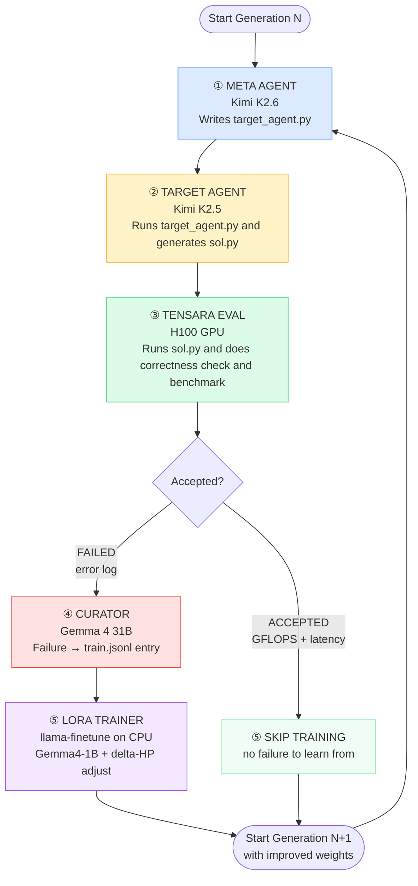

# recursive-self-improvement

**A Recursive Self-Improving AI that fine-tunes its own weights from failures — meta agent, target agent, LoRA, repeat.**

Built for the [AIEWF Hackathon 2026](https://cerebralvalley.ai/e/aiewf-hackathon-2026/details).

---

## What it does



Each generation, the loop runs five steps:

1. **Meta agent** (Kimi K2.6) writes a `target_agent.py` script — a Python program that instructs the target LLM how to approach the GPU kernel task
2. **Target agent** (Nemotron Ultra 550B) executes that script, calls the LLM, and writes a Triton kernel to `sol.py`
3. **Tensara evaluator** submits `sol.py` to a remote H100 — first checks correctness, then benchmarks for GFLOPS and latency
4. **Curator** (Gemma 4 31B) reads the failure log and `sol.py` and produces a structured `(prompt, completion)` training pair → appended to `train.jsonl`
5. **LoRA trainer** (`llama-finetune`) fine-tunes Gemma4-1B on `train.jsonl` on CPU — hyperparameters (rank, LR, epochs) self-adjust based on ΔPerformance

```
Gen 0:  Kimi writes strategy → Nemotron writes kernel → WRONG_ANSWER → Gemma curates → train Gemma4-1B
Gen 1:  improved strategy    → better kernel          → ACCEPTED     → 41 GFLOPS
Gen 2:  ...                                                           → 56 GFLOPS (+36%)
```

---

## Execution flow in detail

### Step 1 — Meta agent (`rsi/loop.py` → `rsi/agent.py`)

`run_meta_agent()` calls **Kimi K2.6** on DO Model Studio with a system prompt that instructs it to write a Python script. The script it produces (`target_agent.py`) will:
- Read the task description from the `TASK_MD` env var
- Call the target LLM via the OpenAI-compatible API (`OPENAI_BASE_URL`, `OPENAI_API_KEY`, `MODEL_NAME`)
- Use `max_tokens=8000` — enough for the model to think and then produce full kernel code
- Fall back to `reasoning_content` if `content` is `None` (handles thinking models like Nemotron)
- Write the kernel to `sol.py` in `OUTPUT_DIR`

Kimi's output is stripped of markdown fences and saved as `gen-N/target_agent.py`.

### Step 2 — Target agent (`rsi/loop.py` → subprocess)

`run_target_agent()` executes the generated `target_agent.py` as a subprocess with a 600-second timeout. Environment variables passed in:

| Env var | Value |
|---|---|
| `OPENAI_BASE_URL` | `https://inference.do-ai.run/v1/` |
| `OPENAI_API_KEY` | `MODEL_ACCESS_KEY` |
| `MODEL_NAME` | `nemotron-3-ultra-550b` |
| `TASK_MD` | path to `tasks/gpu_kernel_task/task.md` |
| `OUTPUT_DIR` | path to `runs/run-NNN/gen-N/` |

The target agent calls **Nemotron Ultra 550B** and writes `sol.py` to `OUTPUT_DIR`.

### Step 3 — Tensara evaluation (`tasks/gpu_kernel_task/evaluate.py`)

`evaluate.py` is invoked as a subprocess. It:

1. **Locates** `sol.py` in the gen directory
2. **Static analysis** — AST-checks the Triton kernel for common errors before hitting the API:
   - Unused `tl.constexpr` params (cause `COMPILE_ERROR`)
   - `.ravel()` calls (invalid in Triton)
   - `tl.cdiv()` with non-constexpr first arg
   - Missing `import torch`
3. **Correctness check** — calls `TensaraClient.run_checker()` against the reference implementation on H100. If this fails, skips benchmarking and saves `results.json` with the failure.
4. **Benchmark** — if correctness passes, calls `TensaraClient.run_benchmark()` and collects per-shape GFLOPS and latency via SSE streaming
5. **Leaderboard comparison** — fetches the current leaderboard best and reports whether the solution beats it
6. **Saves** `results.json` with status, accuracy, average latency (ms), average GFLOPS, and per-shape breakdown

Possible `status` values: `ACCEPTED`, `WRONG_ANSWER`, `COMPILE_ERROR`, `RUNTIME_ERROR`, `STATIC_CHECK_FAILED`, `NO_SOLUTION_FILE`.

### Step 4 — Curation (`rsi/curate.py`)

On any non-`ACCEPTED` status where `sol.py` exists, `curate_via_api()` calls **Gemma 4 31B** with:
- The failed kernel code
- The error message from `results.json`

The curator returns a JSON object with `prompt` (what went wrong and how to fix it) and `completion` (the corrected kernel). This is appended as one line to `train.jsonl`.

### Step 5 — LoRA training (`rsi/train.py`)

Only runs if `--base-model` is provided and `train.jsonl` is non-empty.

`run_lora_training()` invokes `llama-finetune` with:
- `--model-base` — Gemma4-1B GGUF (or the previous gen's merged GGUF)
- `--train-data` — `train.jsonl`
- `--checkpoint-in` — previous gen's LoRA adapter (Gen 0 starts fresh)
- LoRA hyperparameters from `LoraConfig`

After training, `merge_lora()` bakes the adapter into a new standalone GGUF (`gemma4-genN.gguf`).

**Hyperparameter self-adjustment** (`HyperparamTracker`):
- ΔPerformance > 0 (improving): keep current config
- ΔPerformance < 0 (regression): halve LR, add 2 epochs
- ΔPerformance = 0 (stalled): double rank and alpha, increase LR by 1.5×

---

## Architecture

```
providers/do.json               ← DO Model Studio endpoint + auth env var
profiles/kimi26-do.json         ← meta agent   (Kimi K2.6)
profiles/nemotron-do.json       ← target agent (Nemotron Ultra 550B)
profiles/curator-do.json        ← curator      (Gemma 4 31B)

rsi/loop.py                     ← main orchestrator (5-step RSI cycle)
rsi/agent.py                    ← OpenAI-compat LLM caller
rsi/curate.py                   ← failure logs → train.jsonl
rsi/train.py                    ← llama-finetune wrapper + hyperparameter tracker

tasks/gpu_kernel_task/
  task.md                       ← problem statement (matrix-vector multiply)
  evaluate.py                   ← Tensara submission + SSE result parser
  tensara_client.py             ← lightweight Tensara API client (no dependencies)

setup/droplet_setup.sh          ← DO CPU droplet initialization + llama.cpp build
```

---

## Quickstart

### 1. Clone and configure

```bash
git clone https://github.com/<you>/recursive-self-improvement
cd recursive-self-improvement
cp .env.example .env
# fill in MODEL_ACCESS_KEY and TENSARA_API_KEY
```

### 2. Install (via miniforge3)

```bash
mamba create -n rsi python=3.10 -y
mamba activate rsi
pip install -r requirements.txt   # openai, pydo
```

### 3. Run (API-only, no local training)

```bash
source .env
python -m rsi run \
  --problem matrix-vector \
  --meta-agent-profile profiles/kimi26-do.json \
  --target-agent-profile profiles/nemotron-do.json \
  --curator-profile profiles/curator-do.json \
  --max-gen 5 \
  --run-id 001 \
  --run-dir ~/rsi_runs/runs
```

### 4. Run with RSI (LoRA training on CPU)

```bash
# First provision a DO CPU droplet:
bash setup/droplet_setup.sh

# Then run with the local base model:
python -m rsi run \
  --problem matrix-vector \
  --meta-agent-profile profiles/kimi26-do.json \
  --target-agent-profile profiles/nemotron-do.json \
  --curator-profile profiles/curator-do.json \
  --base-model /opt/models/google_gemma-4-1b-it-Q4_K_M.gguf \
  --llama-bin-dir /opt/llama.cpp/build/bin \
  --threads 8 \
  --max-gen 10 \
  --run-id 001 \
  --run-dir ~/rsi_runs/runs
```

---

## Environment variables

| Variable | Used by | Description |
|---|---|---|
| `MODEL_ACCESS_KEY` | `providers/do.json` | DO Model Studio inference key (`doo_v1_...`) |
| `TENSARA_API_KEY` | `evaluate.py` | Tensara platform key |
| `TENSARA_USERID` | `tensara_client.py` | Username for local submission cache |

---

## Requirements

- Python 3.10+
- `openai` and `pydo` Python packages
- DO Model Studio `MODEL_ACCESS_KEY`
- Tensara API key
- *(for LoRA training)* CPU machine with llama.cpp built (`llama-finetune`, `llama-export-lora`)

---

## RSI — what makes it recursive?

The loop is recursive because:
- The model's own failures generate the next training batch
- The training config adjusts based on ΔPerformance each generation
- The fine-tuned model from gen N becomes the base for gen N+1
- There is no human in the loop after generation 0

This is an early-stage implementation of [Recursive Self-Improvement](https://en.wikipedia.org/wiki/Recursive_self-improvement) — models that bootstrap their own capabilities from their own mistakes.

---

## License

MIT
